  
  <h1 align="center"></h1>

## ~About Me

<table>
  <tr>
    <td valign="middle">
      
    </td>
    <td valign="middle">
      <h3>This is me, doing my thing. I build stuffs, break code, and repeat. Welcome to my digital workspace!</h3>
    </td>
  </tr>
</table>

## ~Skills

<table>
  <tr>
    <td valign="top">
      <ul>
        <li><b>Languages:</b> Python, Java, JavaScript</li>
        <li><b>Backend & System Design:</b> Node.js, REST APIs, Microservices Architecture, Nginx, API Gateway, Service Decomposition</li>
        <li><b>Databases:</b> MongoDB, PostgreSQL, Firebase, Redis</li>
        <li><b>Web & Frontend:</b> React, Next.js, Tailwind CSS, HTML5</li>
        <li><b>Data & AI:</b> Qdrant, Memo, GraphQL API Integration, Model Context Protocol (MCP)</li>
        <li><b>Core CS:</b> Data Structures & Algorithms, OOP, Machine Learning, System Design, <a href="https://leetcode.com/u/_NITHEESH/">LeetCode</a></li>
        <li><b>Tools:</b> Git, GitHub, VS Code, and AI tools</li>
        <li><b>Resume:</b> <a href="./NITS.RESUME.docx">Download My Resume</a></li>
      </ul>
    </td>
    <td valign="middle">
      
    </td>
  </tr>
</table>

<h3 align="center"><i>"If it's not good, call it version 1.0"</i></h3>

  

## ~Top Repositories

<table>
  <tr>
    <td width="50%" valign="top">
      

        

          
        

        

          GitHub Repository Discovery CLI & MCP Server. Splits natural language queries into parallel searches and ranks results.
        

      

    </td>
    <td width="50%" valign="top">
      

        

          
        

        

          Locally-running agentic AI desktop assistant executing 45+ natural language commands with multi-LLM routing and OCR.
        

      

    </td>
  </tr>
  <tr>
    <td width="50%" valign="top">
      

        

          
        

        

          Agricultural market platform for direct farmer-to-buyer transactions, APMC pricing, and LLaVA crop disease detection.
        

        

          <a href="https://affarmers.vercel.app" style="color: #58a6ff; text-decoration: none; margin-right: 12px; font-weight: 500;">User App, </a>
          <a href="https://afadmin.vercel.app" style="color: #58a6ff; text-decoration: none; font-weight: 500;">Admin App</a>
        

      

    </td>
    <td width="50%" valign="top">
      

        

          
        

        

          A collaborative crisis management and emergency response platform designed to coordinate resources and streamline communication in real-time.
        

      

    </td>
  </tr>
</table>

## ~Connect with me

<table>
  <tr>
    <td valign="middle" align="center">
      
    </td>
    <td valign="middle">
      &nbsp;&nbsp;
    </td>
  </tr>
</table>

